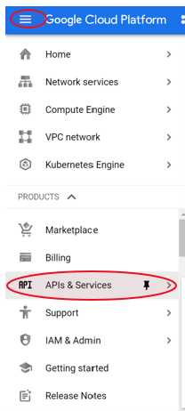
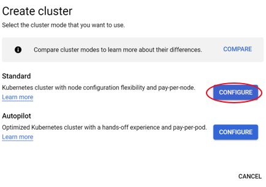

# GKE Route-based Cluster

## Sign up for free trial account on GCP

For this lab, you will need a google cloud account. Sign up for a free trial account on GCP.
1.	Go to console.cloud.google.com and click ‘Create Account’ ‘For myself’:

 
 

2.	Signin to your account. (Find signin in the top right corner.)
 
  
 
 
 
## Select your project
If you haven’t created a project yet, create a project. 
Select the project you have created from the dropdown list.

  

## Enable Cloud APIs
For each service you use, you need to ensure the Google cloud APIs are enabled. In this step, follow the steps to enable the Container Registry API.
 
From the cloud console, go to the API and Services page.

 

Select  **+Enable APIs and Services**.

 

Select container Registry API and click Enable.
 
  

Enable the following two APIs:

Kubernetes API

Compute Engine API

## Setup cloud shell

Connect to the cloud shell, setup project variables and run the following steps to build an image.

-	On the top bar to the right, Click Activate to connect to the cloud shell.

-	Setup Project ID variable in cloud shell. Click  on the Project dropdown in the top bar of the console to get the project ID.

    export PROJECT_ID=\<your project ID\>

    echo $PROJECT_ID

## Build Container Image
Download the sample app:

We will use a sample hello app. Run the following command in your cloud shell.

    git clone https://github.com/GoogleCloudPlatform/kubernetes-engine-samples

**Create docker image:**

The cloud shell includes Docker. Go to the hello-app directory and build docker image using the following  commands:

    cd kubernetes-engine-samples/hello-app

    docker build -t gcr.io/${PROJECT_ID}/hello-app:v1 .

    docker images

**Test locally:**

docker run --rm -p 8080:8080 gcr.io/${PROJECT_ID}/hello-app:v1

Open a new terminal to test the app is running:

    curl http://localhost:8080

**Push the image to container registry:**
Google Container Registry is found at gcr.io/\<PROJECT ID\>.

Upload the image to this registry.

    gcloud auth configure-docker
    docker push gcr.io/${PROJECT_ID}/hello-app:v1

## Create GKE cluster
Next, create a GKE zonal route-based cluster.

a.	From the menu, navigate to the Kubernetes engine page.

b.	Click +Create to create a new cluster.

c.	Select Standard cluster mode: 

d.	On the ‘Cluster basics’ page, configure the following values:
- 	Name: hello-cluster

-	Location type: Zonal

-	Master version: Release Channel

-	Release Channel: Rapid channel

e.	On the left menu, select node pools and add the following configuration:

- 	Name: default-pool

- 	Number of nodes: 3
- 	Select Enable autoscaling with minimum number of nodes 1 and maximum nodes 3.

Under ‘Nodes’, 

-  	Machine Configuration: Series: N1
- 	Machine type: n1-standard-1
- 	Enable preemptible nodes
- 	Networking: hello-nodes

Under Cluster -> Networking
- 	Select Public cluster
- 	Network: default
- 	Subnet: default
- 	Advanced networking:

Disable VPC-native routing

Disable HTTP Load balancing

Click Create once you have configured the above values.

Deploy application

Next, deploy an app to the cluster.
-	Go to the cluster menu and select the cluster you just created. Click DEPLOY from the top menu options.
-	Select existing container image. 
-	For image path, select the image from the container registry you previously created, then click DONE.

Click DONE and CONTINUE to configure the application details as follows:

Application name: hello-app

Namespace: default

Labels: Key: app, Value: hello-app

Cluster: hello-cluster

Click DEPLOY.

Verify pods are successfully created and running.

## Create a service for the app

To make the app accessible to the external world, from the deployment page, click EXPOSE to create a service. Configure the following information:

External port: 80

Target port: 8080

Service type: Load balancer

Service name: hello-app-service

Click EXPOSE.

## Verify access to your application
On the GKE page, select Services and Ingress from the left menu.

Verify your service is up and running.

You should see a public IP assigned to your external load balancer.

Access the service using the public IP address of the load balancer. The hello-app application Hello World page should load successfully. 

You have successfully deployed a GKE cluster on Google cloud.

## Connect to the cluster
From the Kubernetes Engine page, go to the Cluster menu and click on the cluster we just created. 

Click CONNECT from the top menu bar.

Click RUN IN CLOUD SHELL. This should open the cloud shell. Run the command that is pasted in the  shell to get the cluster credentials.

Run the following command to verify successful run:

    kubectl get pods

## Update pods

Update the hello app:

In your cloud shell, you have cloned the hello app. 

Change to directory kubernetes-engine-samples/hello-app and open file main.go for editing. 

Update the version  value from 1.0.0 to 2.0.0.

Ensure you have set the variable for project ID again.

    export PROJECT_ID=\<your project ID\>

    echo $PROJECT_ID

Build docker image:

    docker build -t gcr.io/${PROJECT_ID}/hello-app:v2 .

Push the image to the container registry:

    docker push gcr.io/${PROJECT_ID}/hello-app:v2

Verify an updated image appears in the container registry with a label of v2.

Now we are ready to update the image on the pods:

You can update pod application from the workloads menu.

Click ACTIONS -\> ROLLING UPDATE

Select the right image from the container registry and paste it in the Container Image field.

Watch the pods status until all pods are updated.

## Delete Cluster

From the cluster menu, select the cluster you just created. Click DELETE. 
This will delete all the configuration related to the cluster.
